# TreatMed OS — Flow chart เมนูแอป × Workflow (ชื่อ Function / Page)

**ไฟล์ PNG (เรนเดอร์แล้ว):** โฟลเดอร์ [`docs/diagrams/`](./diagrams/) — ดูรายการใน [`docs/diagrams/README.md`](./diagrams/README.md)

อ้างอิงเมนูจาก `components/layout/Sidebar.tsx` และ route ใน `app/(dashboard)/`.

> **หมายเหตุ:** บางหน้า SE / Monitor ยังเป็น mock UI ในไฟล์ — ชื่อฟังก์ชันที่ระบุคือของโค้ดปัจจุบันใน repo

---

## 1) ภาพรวม Shell + เมนู (Role)

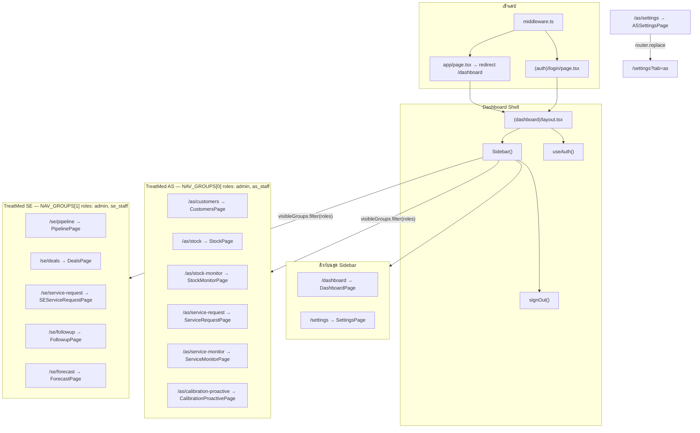

---

## 2) ชั้น Mock Store (ข้อมูลที่หลายหน้า AS ใช้ร่วม)

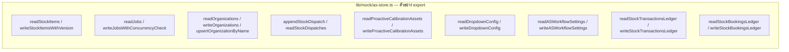

---

## 3) Dashboard

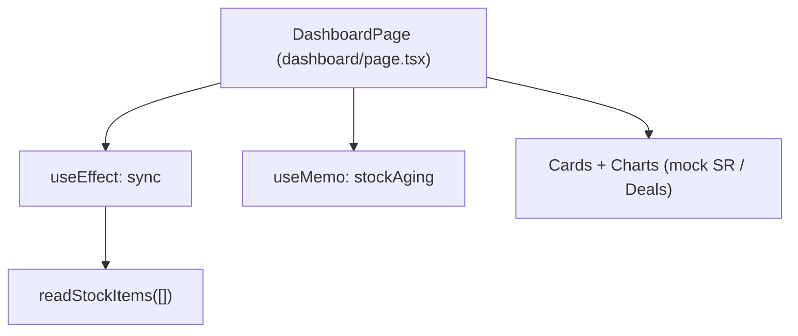

---

## 4) Settings (Global / AS / SE)

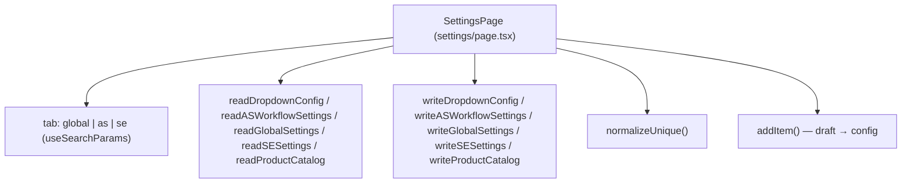

---

## 5) AS — Customer Register

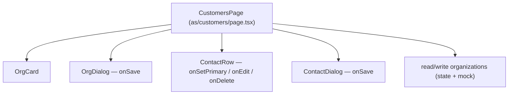

---

## 6) AS — Stock In/Out (ไฟล์ใหญ่ — workflow หลัก)

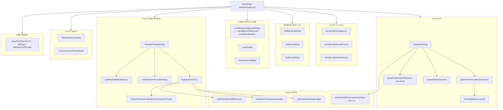

---

## 7) AS — Service Request

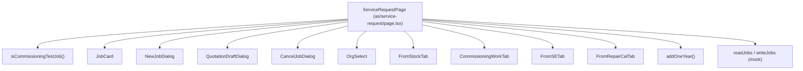

---

## 8) AS — Calibration Proactive

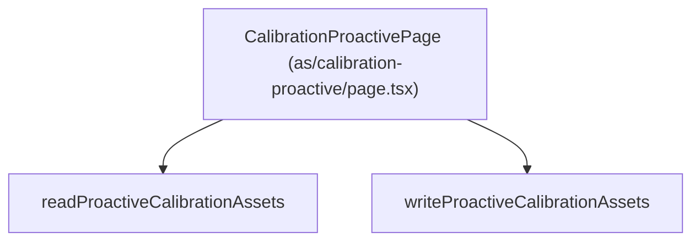

---

## 9) AS — Stock Monitor / Service Monitor (Mock ในไฟล์)

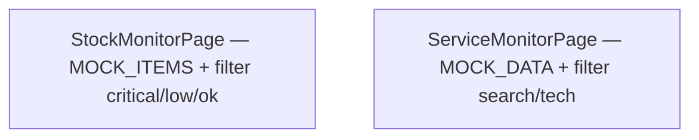

---

## 10) SE — Pipeline / Deals / Follow Up / Forecast

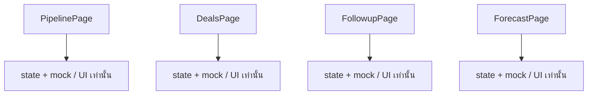

---

## 11) SE — Service Request

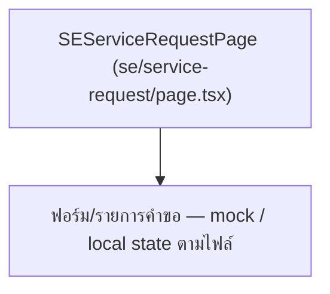

---

## สรุปไฟล์หลักต่อเมนู

| เมนู (Sidebar) | Route | Default export / Shell |
|----------------|-------|-------------------------|
| Dashboard | `/dashboard` | `DashboardPage` |
| Settings | `/settings`, `/as/settings` | `SettingsPage`, `ASSettingsPage` (redirect) |
| Customer Register | `/as/customers` | `CustomersPage` |
| Stock In/Out | `/as/stock` | `StockPage` |
| Stock Monitor | `/as/stock-monitor` | `StockMonitorPage` |
| Service Request (AS) | `/as/service-request` | `ServiceRequestPage` |
| Service Monitor | `/as/service-monitor` | `ServiceMonitorPage` |
| Calibration Proactive | `/as/calibration-proactive` | `CalibrationProactivePage` |
| Sales Pipeline | `/se/pipeline` | `PipelinePage` |
| Deal & Activity | `/se/deals` | `DealsPage` |
| Service Request (SE) | `/se/service-request` | `SEServiceRequestPage` |
| Follow Up | `/se/followup` | `FollowupPage` |
| Forecast / Month | `/se/forecast` | `ForecastPage` |
| ออกจากระบบ | — | `signOut()` ใน `Sidebar` |

---

## วิธีดู diagram

- เปิดไฟล์นี้ใน **GitHub**, **VS Code** (Mermaid preview), หรือวาง block `` ```mermaid `` ในเครื่องมือที่รองรับ Mermaid
